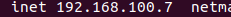
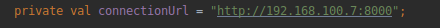
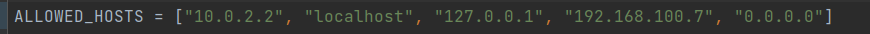

# ynvest-tube

<div align="center" style="display: flex;flex-direction: row">
  
</div>

## Table of contests

- [ynvest-tube](#ynvest-tube)
  - [Table of contests](#table-of-contests)
  - [Introduction](#introduction)
  - [General](#general)
    - [Demo](#demo)
    - [Server](#server)
  - [Installation](#installation)
    - [Application](#application)
      - [Device setup](#device-setup)
    - [Server](#server-1)
  - [Launch](#launch)
  - [Code Example](#code-example)
  - [Technologies](#technologies)

## Introduction

`YnvestTube` is a mobile economy-based multiplayer game. User can incarnate into investor and take part in auctions.
Auction trade _objects_ are real `youtube` videos, more precisely auction object is a `youtube` video rental for few
days. Game server observes them on [YouTube](https://www.youtube.com) and stores live data about views, likes and
dislikes in `SQL` database. Videos data is updated once per hour, so we can clearly say it is actual. Each user may win
auction by beating other players' bids. At the end of renting user cash is increased by value depending on the `growth`
of views during the rental. Well, users may use a lot of more or less intelligent strategies like raising the price of
an auction item they don't even want to rent, just to make it difficult for others to play ;).

## General

### Demo
  


### Server

Application communicates with server written in `Django`, `Python`. List of `endpoints`, `periodic tasks` and more details are
available in repository created specially in this
purpose [YnvestTubeServer](https://github.com/sqoshi/ynvest-tube-server).
We used `Redis` as a `periodic task` caller.


## Installation
### Application
Application should be installed on `device` or `emulator` using `anrdroid studio` IDE.

#### Device setup

1. **Find you local ip address**
    To play on device check your local ip address using 
    `ifconfig -a`. Output should contain a line with address similar to example below.
      

2. **Change app `connectionUrl`**
   Find `repository.kt` file and change value of variable `connectionUrl` to your local ip address.
   Result should look like in example.
     


3. **Allow your local ip address on server**
   Add your local ip address( here `192.168.100.7` to `ALLOWED_HOSTS`   list in `settings.py` in `ynvest-tube-server`
     

   

### Server
Server installation and launch guide may be found [here](https://github.com/sqoshi/ynvest-tube-server/#installation).

Server must be runned locally via script `run_server.sh`.

## Launch
1. Run locally `ynvest-tube-server`
2. Start app on device.

## Code Example
```kotlin

fun startRefresher() {
        repository = Repository()

        refreshTask = Thread {
            while (true) {
                if (userSubscribers.any())
                    repository!!.getUser(::userObtained, ::requestFailed)

                if (userDetailsSubscribers.any())
                    repository!!.getUserDetails(::userDetailsObtained, ::requestFailed)

                if (auctionListSubscribers.any())
                    repository!!.getActionList(::auctionListObtained, ::requestFailed)

                for (subscriber in auctionSubscribers.values) {
                    repository!!.getActionDetails(
                        subscriber.successful,
                        ::requestFailed,
                        subscriber.auctionId
                    )
                }

                sleep(refreshRateInMilis)
            }
        }

        refreshTask.start()
    }

```

## Technologies

- kotlin
- retrofit2


